
  
 <h1 align="center">📦 Inventory Management System</h1> 
 Sistem manajemen inventory berbasis web untuk pengelolaan stok, transaksi, dan data bisnis secara efisien. 
 
     

🚀 About Project

Inventory Management System merupakan aplikasi berbasis web yang dirancang untuk membantu pengelolaan persediaan barang secara terstruktur dan terintegrasi. Sistem ini mendukung proses bisnis mulai dari pencatatan produk, pengelolaan stok, hingga transaksi dan pembuatan invoice.

Pendekatan yang digunakan adalah Role-Based Access Control (RBAC) untuk memastikan keamanan dan pembagian hak akses pengguna secara optimal.

✨ Key Features
📊 Dashboard monitoring real-time
📦 Manajemen produk & kategori
📏 Pengelolaan satuan barang
🏢 Data supplier
👥 Data customer
🧾 Transaksi order
🖨️ Cetak invoice otomatis
🔐 Role & Permission management (RBAC)
🖼️ System Preview
📊 Dashboard

  
 Menampilkan ringkasan data penting seperti jumlah produk, transaksi, supplier, dan customer sebagai pusat monitoring sistem.
📂 Kategori

 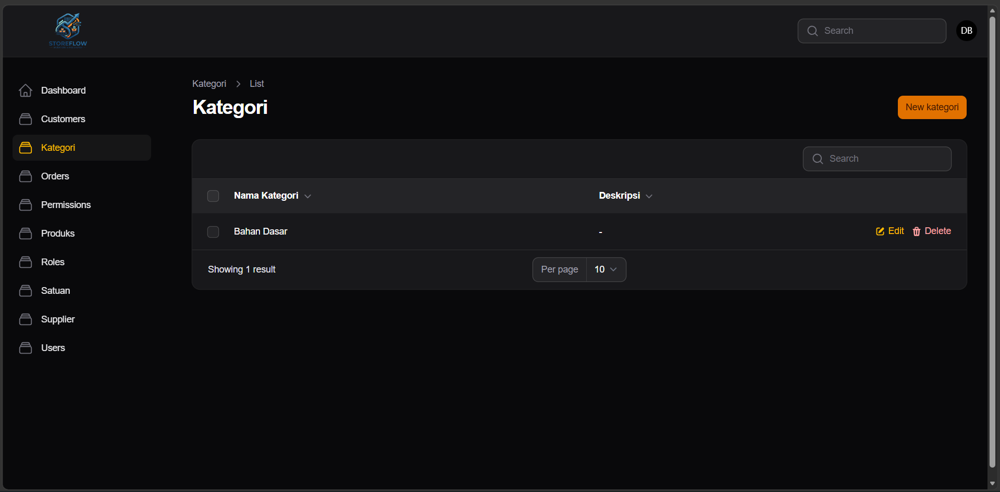 
 Digunakan untuk mengelompokkan produk agar pengelolaan lebih terstruktur dan sistematis.
📦 Produk

 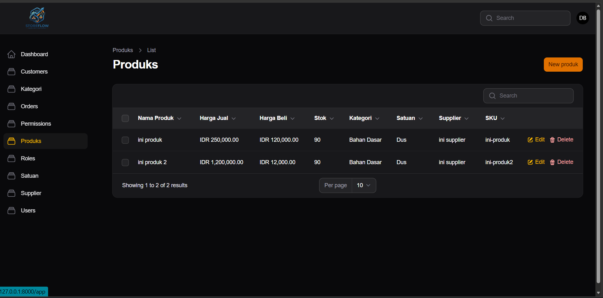 
 Menampilkan data lengkap barang termasuk stok, harga, dan kategori sebagai inti dari sistem inventory.
📏 Satuan

 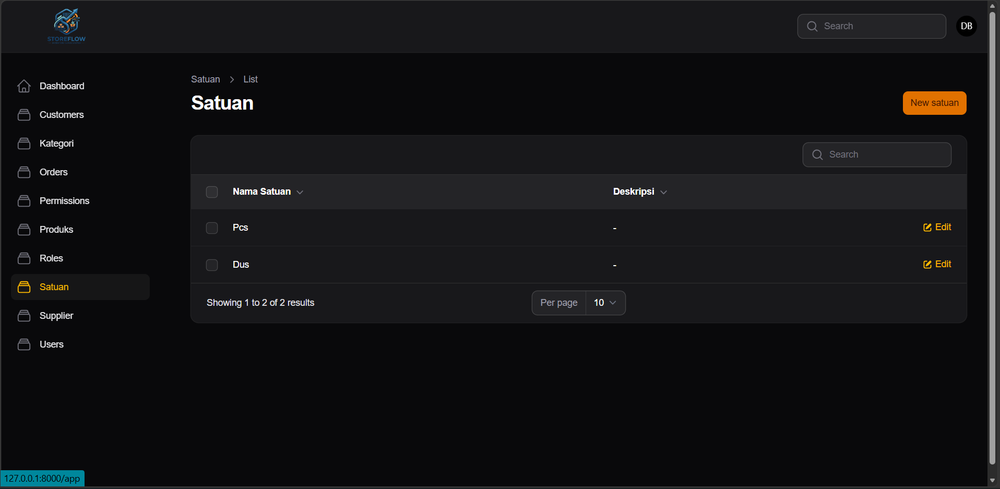 
 Digunakan untuk mendefinisikan unit barang seperti pcs, box, liter, dan lainnya.
🏢 Supplier

 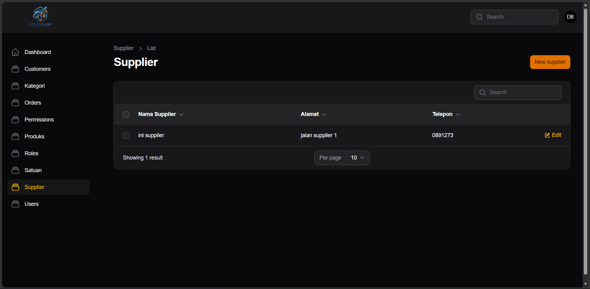 
 Berisi data pemasok untuk mendukung proses pengadaan barang.
👥 Customer

 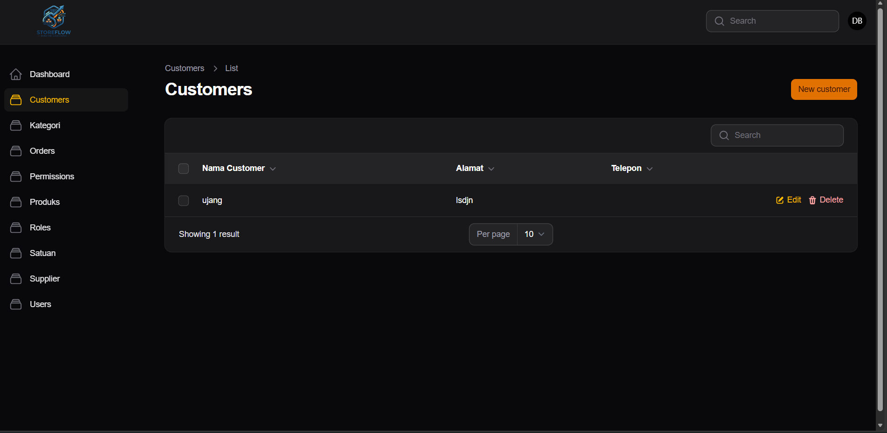 
 Menyimpan data pelanggan yang melakukan transaksi.
🧾 Order

 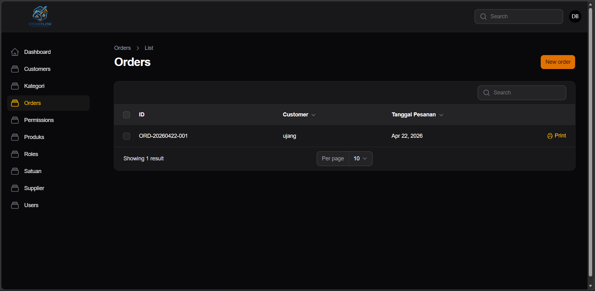 
 Digunakan untuk mencatat transaksi pembelian atau pemesanan barang.
🖨️ Cetak Invoice

 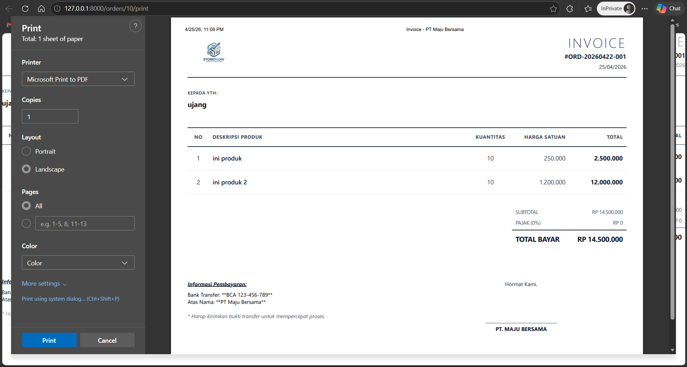 
 Menghasilkan invoice sebagai bukti transaksi yang dapat dicetak.
🔐 Roles

 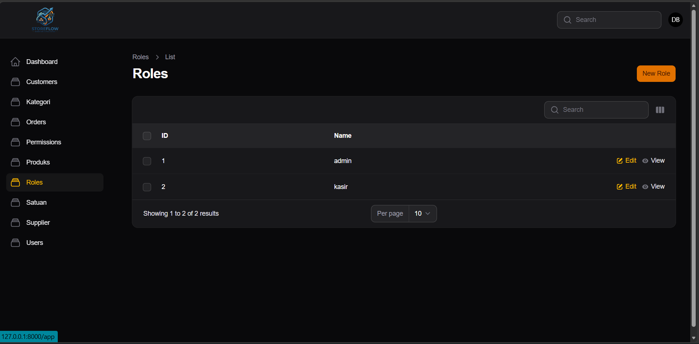 
 Mengelola peran pengguna dalam sistem.
📝 Form Roles

 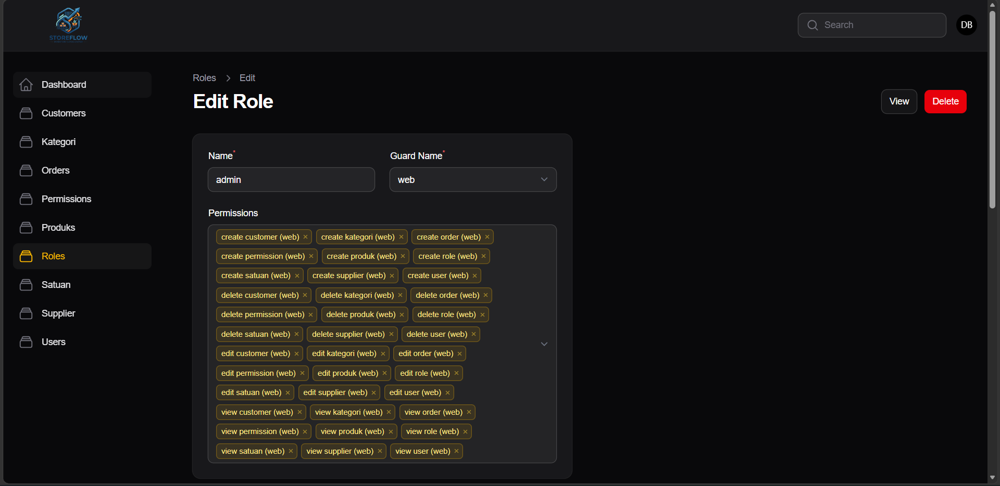 
 Digunakan untuk menambahkan atau mengedit role beserta hak aksesnya.
🔑 Permission

 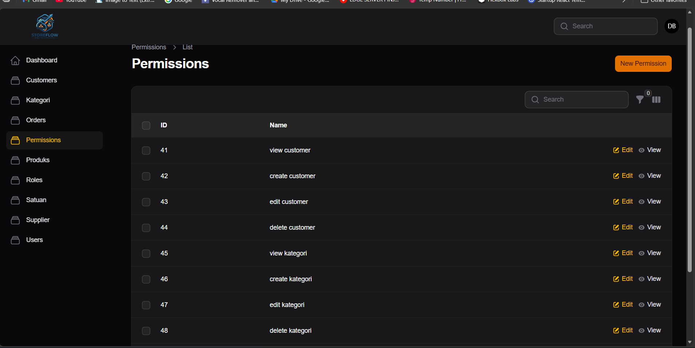 
 Menampilkan daftar izin akses dalam sistem.
📝 Form Permission

 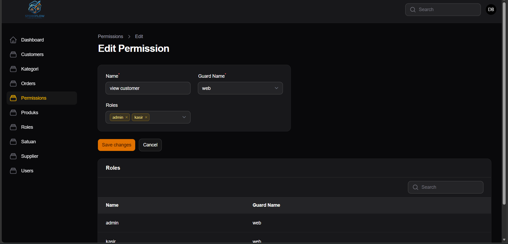 
 Digunakan untuk mengatur permission agar sistem lebih fleksibel dan aman.
🛠️ Tech Stack
⚙️ Laravel
🎛️ Filament Admin Panel
🗄️ MySQL
🎨 Tailwind CSS
⚙️ Installation
git clone https://github.com/username/nama-repo.git
cd nama-repo

composer install
cp .env.example .env
php artisan key:generate

php artisan migrate --seed
php artisan serve
📁 Project Structure
inventory/
└── dokumentasi/
    ├── cetak_invoice.png
    ├── customer.png
    ├── dashboard_user.png
    ├── Kategori.png
    ├── order.png
    ├── permission.png
    ├── permission_form.png
    ├── produk.png
    ├── roles.png
    ├── roles_form.png
    ├── satuan.png
    └── supplier.png
🎯 Project Goals
Meningkatkan efisiensi pengelolaan stok
Mengurangi kesalahan pencatatan manual
Menyediakan data real-time
Mendukung pengambilan keputusan berbasis data
🤝 Contributing

Kontribusi terbuka untuk pengembangan lebih lanjut. Silakan fork repository dan ajukan pull request.

📄 License

Project ini menggunakan lisensi MIT.
